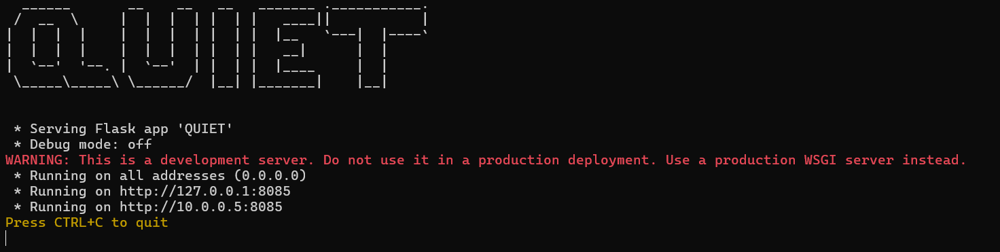

# QUIET
# Installation
Currently QUIET only supports Windows 11 and Qiskit

### Dependencies

Anaconda Python distribution is required [here](https://www.anaconda.com/products/distribution):

Steps:
1. Clone repository
2. cd QUIET 
3. conda env create -f environment.yml
4. conda activate quiet

## Usage:
##### Before running make sure all the required fields are filled in configuration.yml
    python main.py

#### For filtering noise QUIET requires a qasm_circuit as input. An example is shown in testdriver.py

    import requests
    import json
    import util as U
    
    circuits = U.load_training_circuits()      # Loading an example circuit and converting
    qasm_circuit = U.qasm2.dumps(circuits[0])  # to qasm in qiskit
    use_simulator = True                       # To use noise execution simulator false for real system
    use_job_id = None                          # In case we have job id from any QUIET initiated execution
    
    # Define the URL of the server
    url = 'http://localhost:8085/filter'
    
    # Define the data to send in the POST request
    data = {
        "qasm_circuit": qasm_circuit,
        "use_simulator": use_simulator,
        "use_job_id": use_job_id
    }
    
    # Convert the data to JSON format
    json_data = json.dumps(data)
    
    # Send the POST request
    response = requests.post(url, data=json_data, headers={'Content-Type': 'application/json'})
    
    # Print the response from the server
    print('Status Code:', response.status_code)
    print('Response Body:', response.json())